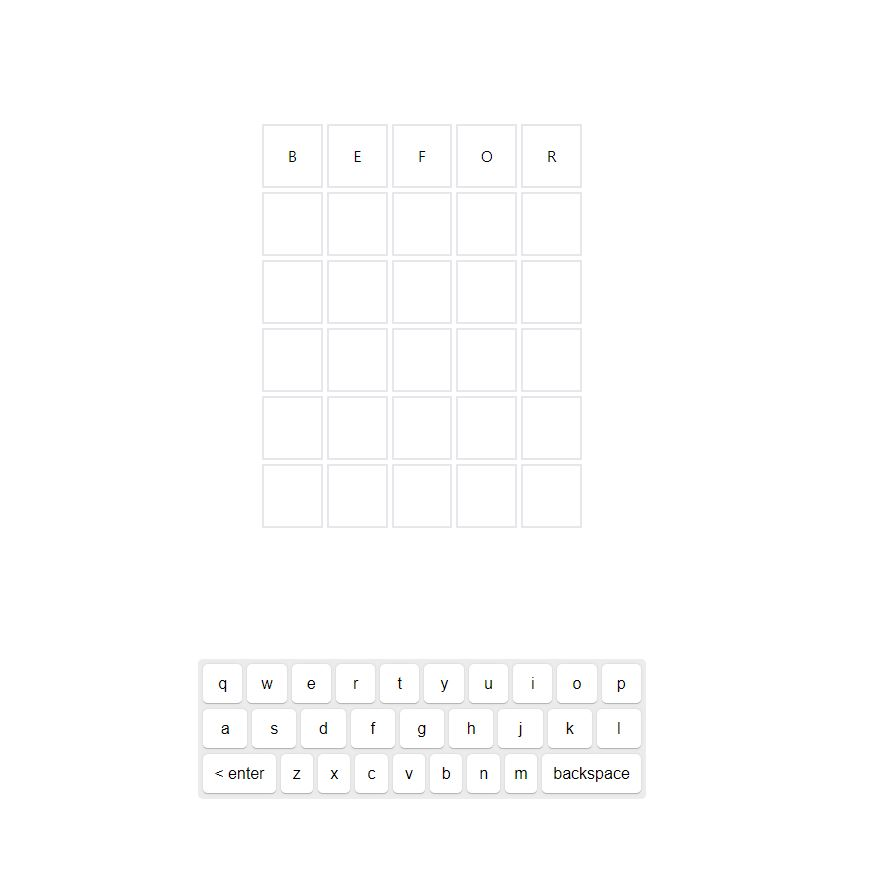

<h1>Wordle Vur.JS</h1>

The game wordle made with vue.js

Write your word!

Click enter to guess (Green -> letter in the right place / Yellow -> The word has the letter but it is not in the right place / White -> The letter does not exist in the word).

Win the game.

Lose the game.

<h1>Run the Project and Play</h1>

To run and play the game you need to follow these steps:

<ul>
  <li>Clone this repository</li>
  <li>Open the code on your IDE</li>
  <li>Run code using 'npm run dev'</li>
</ul>
